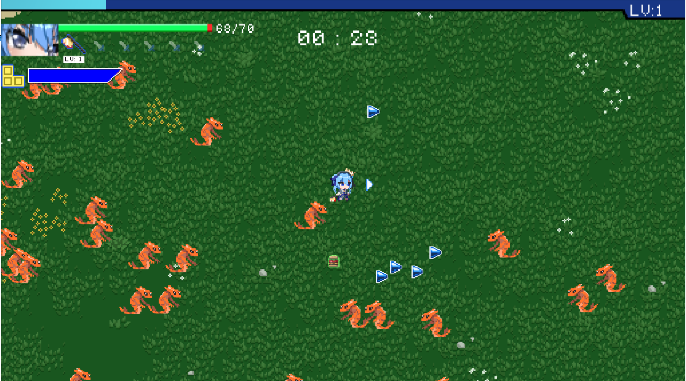
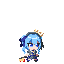
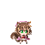
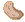
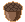
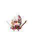
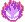

[[English]](README_en.md)

# Holocure but made in C++

- Demo game:

# Giới thiệu game

Holocure là một game thuộc thể loại survivor (tương tự Vampire Survivors). Người chơi điều khiển nhân vật tiêu diệt những con quái vật, lên cấp để nâng cấp vũ khí và chiến thắng trò chơi/

- [0. Cách tải game](#0-cách-tải-game)
    * [a. Cách 1: Không bao gồm code.](#a-cách-1-không-bao-gồm-code)
    * [b. Cách 2: Bao gồm code và có thể biên dịch.](#b-cách-2-bao-gồm-code-và-có-thể-biên-dịch)
- [0.5. Điều khiển](#1bắt-đầu-game)
- [1. Bắt đầu game](#1bắt-đầu-game)
- [2. Chọn level](#2chọn-level)
- [3. Các thành phần trong game:](#3-các-thành-phần-trong-game)
- [4. Cách chơi](#4-cách-chơi)
    * [a. Các loại cây](#acác-loại-cây)
    * [b. Các loại zombie](#bcác-loại-zombie)
- [5. Chiến thắng và thất bại](#5-chiến-thắng-và-thất-bại)
- [Về đồ họa của game:](#về-đồ-họa-của-game)
- [Về source code game](#về-source-code-game)

# 0. Cách tải game

## a. Cách 1: Không bao gồm code.

Tải game (được nén thành .zip) tại link
sau: https://github.com/nmhienbn/PVZ-Kaito-NMH-Edition/releases/tag/published 
Cách này tiết kiệm bộ nhớ và thời gian tải đi rất nhiều (khoảng 103MB). 
Giải nén game vào một thư mục và bật pvz.exe lên và chơi. 

## b. Cách 2: Bao gồm code và có thể biên dịch.

**Bước 1:** Clone repo này về (Khoảng 800 MB - do có cả lịch sử các phiên bản).  
Hoặc Chọn Code -> Download Zip (Khoảng 90MB)

- Tất cả code đều nằm trong thư mục src. 
- Có thể nhảy đến bước 5 để chơi luôn.

**Bước 2:** Cài mingw. Ở đây tôi cài đặt phiên bản MinGW-W64
GCC-8.1.0 [x86_64-posix-seh](https://sourceforge.net/projects/mingw-w64/files/Toolchains%20targetting%20Win64/Personal%20Builds/mingw-builds/8.1.0/threads-posix/seh/x86_64-8.1.0-release-posix-seh-rt_v6-rev0.7z/download). 
Một số chú ý:  

- Nếu sử dụng trình biên dịch khác thì phải dịch lại icon: vào thư mục icon rồi dùng
  lệnh `windres main.rc -O coff main.res` trong cmd. 
- Phải xóa ba dll của c++ trong thư mục chứa pvz.exe: `libgcc_s_seh-1.dll`, `libstdc++-6.dll`, `libwinpthread-1.dll`. Ba
  dll này chỉ dành cho người chơi không cài sẵn c++ trong máy.

**Bước 3:** Cài GNU make

**Bước 4:** Mở cmd trong thư mục chứa Makefile và gõ lệnh make.

**Bước 5:** Bật pvz.exe và chơi

# 0.5. Điều khiển
Do thời gian eo hẹp nên hiện tại game chỉ cho phép điều khiển bằng bàn phím.
Sử dụng các phím mũi tên, Enter, Esc, x và z để tương tác với trò chơi.

# 1. Bắt đầu game

Ở màn hình chính người chơi chọn nút Play để tiến hành chọn nhân vật hoặc Quit để thoát trò chơi. 

# 2. Chọn nhân vật và chế độ chơi

Hiện tại game có tổng cộng 3 nhân vật khác nhau. Mỗi nhân vật có vũ khí khởi đầu và chiêu đặc biệt riêng. Người chơi có thể xem vũ khí và chiêu của nhân vật ở hộp bên phải màn hình.

Nhân vật phát sáng khi người chơi đang lựa chọn. Nhấn Enter để lựa chọn nhân vật.

Thời điểm hiện tại game có 2 chế độ chơi: Stage Mode và Endless Mode. Stage Mode kết thúc khi người chơi đánh bại được trùm cuối. Endless Mode thử thách người chơi với làn sóng quái vật không ngơi nghỉ.

# 3. Các thành phần trong game:

-    Player (Người chơi)
     : luôn ở giữa màn hình. Có một mũi tên màu trắng thể hiện hướng đi. Điều khiển bằng các phím mũi tên. Giữ nút z để nhân vật luôn chỉ quay một hướng.

-    Health bar (Thanh mặt trời) 
     : là thanh hiển thị máu của người chơi. Nếu giá trị của thanh máu xuống dưới 0, người chơi sẽ thua.

- EXP bar: thanh kinh nghiệm của người chơi. Người chơi lên cấp khi thanh kinh nghiệm đầy.
- Portrait: hình chân dung ở góc trái bên trên màn hình thay đổi tùy thuộc vào nhân vật mà người chơi chọn.
- Special Bar: thanh biểu thị thời gian hồi của chiêu đặc biệt. Người chơi sử dụng được chiêu đặc biệt bằng cách nhấn phím x khi thanh đầy.
- Thanh vũ khí: liệt kê những vũ khí người chơi đang sở hữu và cấp độ của chúng.
- Timer: Hiển thị thời gian chơi game

- Vũ khí: là thứ giúp bạn tiêu diệt quái vật qua màn. Hiện tại game có 3 vũ khí khởi đầu và 8 vũ khí chung.

- Bố cục game cơ bản:

# 4. Cách chơi

Điều khiển nhân vật sử dụng các nút mũi tên kết hợp với phím z (cố định hướng xoay của nhân vật) để tiêu diệt quái vật.  
Quái vật khi bị tiêu diệt sẽ đánh rơi kinh nghiệm hoặc đồ ăn. Thu thập kinh nghiệm để lên cấp lấy vũ khí và đồ ăn để hồi máu.

## a. Các nhân vật

Có 3 nhân vật người chơi có thể chọn sở hữu vũ khí và chiêu thức khác nhau, bao gồm:

|                                                                             | Tên nhân vật	     | Vũ khí khởi đầu   | Chiêu đặc biệt                                                                          |
|-----------------------------------------------------------------------------|--------------|---------------------------------------|----------------------------------------------------------|
|   | Hoshimachi Suisei	  | Axe Swing| Summon Blocks|
|     | Ayunda Risu	   |  Nuts| Big Nuts|
|        | Nakiri Ayame	    |  Dual Katana| Spirit of the Oni|

## b. Các loại q

- Có 5 loại zombie:

|                                         | Tên zombie 	       | Chức năng                                                                                        |
|-----------------------------------------|--------------------|--------------------------------------------------------------------------------------------------|
|  | Browncoat Zombie	  | Ăn cây và não của bạn.                                                                           |
|    | Flag Zombie	       | Báo hiệu một lượng lớn zombie đang chuẩn bị ra.                                                  |
|    | Conehead Zombie	   | Trâu gấp 3 lần zombie thường                                                                     |
|  | Buckethead Zombie	 | Trâu gấp 6.5 lần zombie thường                                                                   |
|    | Door Zombie	       | Trâu gấp 6.5 lần zombie thường. Không bị ảnh hưởng bởi sự làm chậm của đạn băng nếu vẫn còn cửa. |

# 5. Chiến thắng và thất bại

- Bạn sẽ chiến thắng nếu tiêu diệt hết tất cả zombie trong ván đó.

- Trong Stage Mode: bạn chiến thắng khi đánh bại trùm cuối của màn, thua cuộc khi máu giảm về dưới 0.

- Trong Endless Mode: không có điều kiện chiến thắng vì mục đích của chế độ này là sống sót càng lâu càng tốt.

---

### Về đồ họa của game:

- Lấy từ file đồ họa của game gốc Holocure: https://kay-yu.itch.io/holocure

### Về source code game:

- Data:
  * chứa đường dẫn đến file đồ họa của game.
  * chứa thông tin trong game
- drop:
  * kinh nghiệm, đồ ăn mà quái vật tạo ra sau khi bị đánh bại
- enemy:
  * quái vật tấn công người chơi
- weapon:
  * vũ khí và các chiêu thức của nhân vật
- Hud:
  * giao diện game dành cho người dùng (health bar, exp bar,...)
- Tabs_Title:
  * menu chính khi vừa vào game
- Tabs_CharacterSelect:
  * phòng chọn nhân vật
- Tabs_ModeSelect:
  * chọn chế độ chơi
- Tabs_LevelUp:
  * màn hình lên cấp
- Tabs_End
  * màn hình kết thúc trò chơi (thắng hoặc thua)
- ResourceManager:
  * một singleton phụ trách việc render các thành phần trong game
- Structure:
  * các cấu trúc sử dụng tạo các thành phần của game
    * LTimer: lấy từ LazyFoo: https://lazyfoo.net/tutorials/SDL/23_advanced_timers/index.php
    * LTexture: render texture và chữ, lấy từ LazyFoo (có tự phát triển thêm): https://lazyfoo.net/tutorials/SDL/16_true_type_fonts/index.php
    * LButton: các nút bấm trong game
